# Larrys LogBook

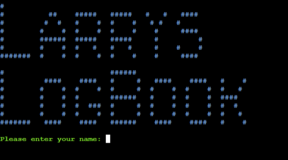

Larrys Logbook is designed to help the user find out their budget for a given time, without having to do any mathematical equations.

Larrys LogBooks works with the simple formula of Available Funds + Income - Expenses, all of which are inside a given timeframe of the user’s choosing.

Visit the deployed application [here](https://larrys-logbook-ef06a242402b.herokuapp.com/).

## Table of Contents
1. [User Experience (UX)](#user-experience-UX)
    1. [Project Goals](#project-goals)
    2. [User Stories](#user-stories)
    3. [Color Scheme](#color-scheme)
    4. [Data Model](#data-model)
    5. [Flowchart](#flowchart)
2. [Features](#features)
    1. [User Name input](#user-information-input)
    2. [User Timeframe Input](#user-timeframe-input)
    3. [User Available Fund Input](#user-available-fund-input)
    4. [User Income Input](#user-income-input)
    5. [User Expense Input](#user-expense-input)
    6. [User Additional Input](#user-additional-input)
    7. [User Data Confirmations](#user-data-confirmations)
    8. [User Data Results](#user-data-results)
3. [Technologies Used](#technologies-used)
    1. [Language Used](#language-used)
    2. [Frameworks, Libraries and Programs Used](#frameworks-libraries-and-programs-used)
4. [Testing](#testing)
    1. [Testing User Stories](#testing-user-stories)
    2. [Code Validation](#code-validation)
    3. [Manual Testing](#manual-testing)
5. [Deployment](#deployment)
6. [Credits](#credits)
7. [Acknowledgements](#acknowledgements)

***

## User Experience (UX)

### Project Goals

* Display enough information to let the user know what Larrys LogBook does.

* Each question/section that is asked/displayed is given the necessary information to be understood by the user.

* Provides input validation to help the user input the correct data.

* Gives insightful and convenient information to the user when the budget projections are displayed at the end.

### User Stories

* As a user, I want to know what Larrys LogBook is about and what it does.

* As a user, I want to understand each step clearly. 

* As a user, I want to know if the input I put in is correct or not, and receive clear feedback of what needs to be corrected.

* As a user, I want the data I put in to be displayed to me and given the option to correct it if needed.

* As a user, I want the final budget information to be displayed clearly and easy to understand.

### Color Scheme

[Colorama](https://pypi.org/project/colorama/) has been used to apply color to the terminal text. This in order to make the program more intuitive and easier to read. 

Here are the colors being used:

* Inputs/questions are displayed in green.

* The heading and final budget page are displayed in blue.

* Data that has been put in is displayed in yellow.

* Errors are displayed with a red background. 

* General information and other content is displayed in plain white. 

### Data Model

Data asked for like name is used for aesthetic purposes while data asked for as available funds amount, income amount and expense amount are used to calculate the surplus of the budget. What is also done with this data, is the input of naming and adding extra data with the data model being able to add up each available fund, income and expense given, to give a total of each respectively. The naming of each available fund, income and expense is recored for the convenience of the user to not have to add up each amount but just state the amount and let the program add it up for them. 

The timeframe data is used to calculate the daily projections of the budget and be displayed to the user at the final budget page.

Extra calculations are used with the data recieved to calculate the surplus, budget per day and ofcourse the totals of each available fund, income and expense for the results page.

### Flowchart

The following flowchart was designed using [Lucidchart](https://lucidchart.com/) in order to plan the logic to be implemented in the program.

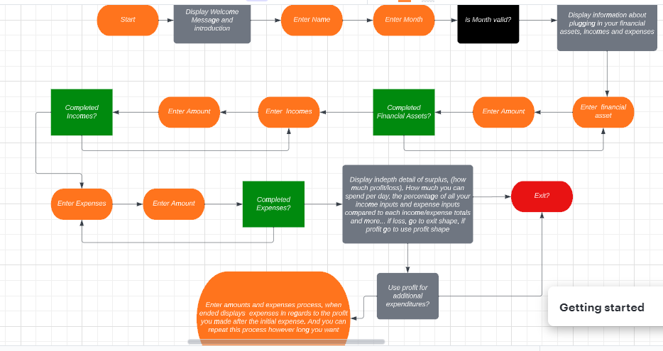

As shown in the flowchart, the original order of functions have been altered/removed whilst in development of the project for conveniance and UX purposes, yet the main plan and idea is still the same.

[Back to top ⇧](#larrys-logbook)

## Features

### User Name input

Collets the users name.

### User Timeframe Input

Collect the users timeframe information in order to use it in the programs calculations.

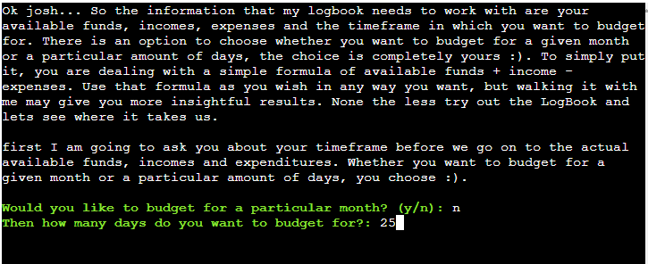
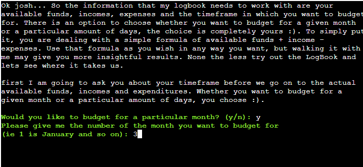

### User Available Fund Input

Collect the users Available Fund information in order to use it in the programs calculations.

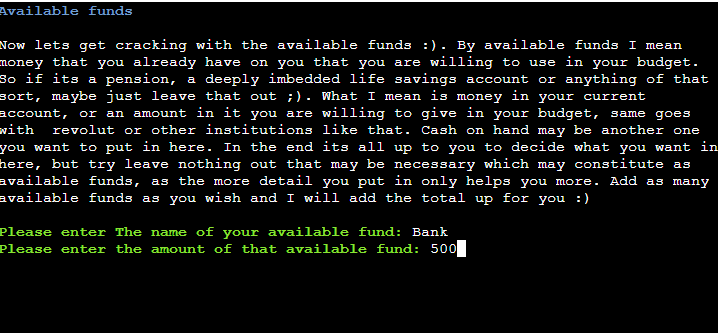

### User Income Input

Collect the users Income information in order to use it in the programs calculations.

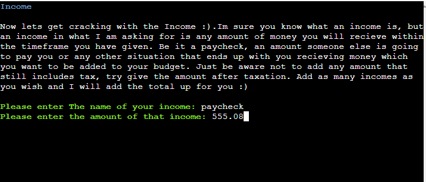

### User Expense Input

Collect the users Expense information in order to use it in the programs calculations.

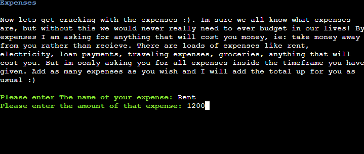

### User Additional Input

Gives the users the option to add extra Available Funds, Incomes and Expenses respectively.

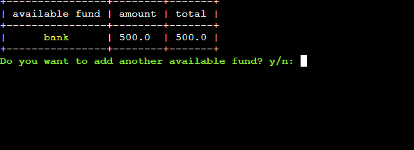
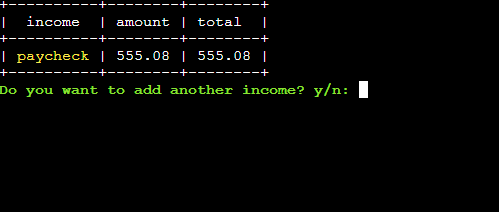
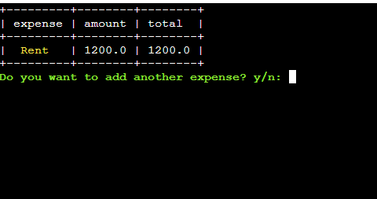

### User Data Confirmations

Gives the users the option to confirm their Data given.

Name Confirmation

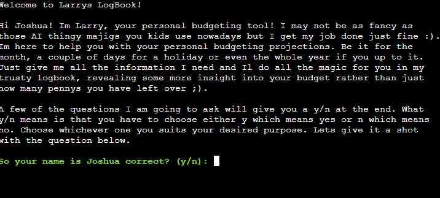

Timeframe Confirmation

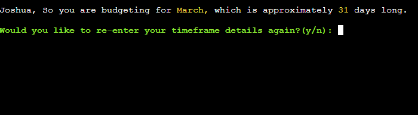

Available Fund Confirmation

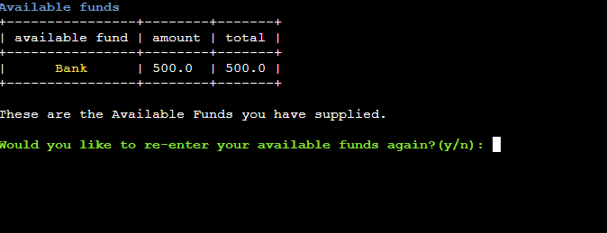

Income Confirmation

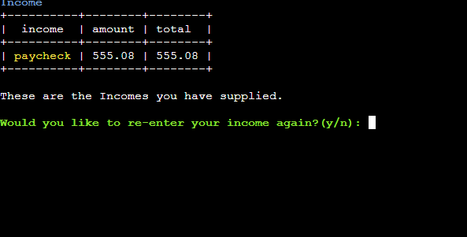

Expense Confirmation

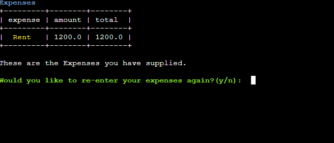

### User Data Results

Displayes the budget page of the results of all information given and the calculations of surplus and budget per day.

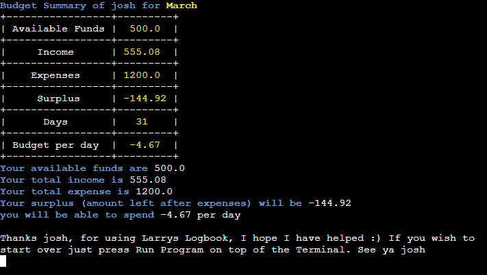

[Back to top ⇧](#larrys-logbook)

## Technologies Used

### Language Used

* [Python3](https://en.wikipedia.org/wiki/Python_(programming_language))

### Frameworks, Libraries and Programs Used

* [Codeanywhere](https://app.codeanywhere.com/) was used for writing code, committing, and then pushing to GitHub.

* [GitHub](https://github.com/) was used to store the project after pushing.

* [Heroku](https://id.heroku.com/) was used to deploy the application.

* [CI Python Linter](https://pep8ci.herokuapp.com/) was used to validate the Python code.

* [BeautifulTable](https://pypi.org/project/beautifultable/) library was used to present the data in table format.

* [Colorama](https://pypi.org/project/colorama/) library was used to apply color to the terminal text. 

* [Lucidchart](https://lucidchart.com/) was used to create the program flowchart.

[Back to top ⇧](#larrys-logbook)

## Testing

### Testing User Stories

* As a user, I want to be given information about the main objective and purpose of Larrys LogBook.

    - Information about Larrys LogBook is given in the welcome message explaining what the application is and what it does. 

* As a user, I want to easily understand what input is needed in each step.

    - Each timeframe, available funds, incomes and expenses are explained before any input is given, to help me as a user understand what I am putting in before I do.

    - An explaination of the y/n option has been explained clearly right at the beginning as it is used often.

    - Input question text is colored in green to differenciate them from other information. 

* As a user, I want to receive feedback if I provide the wrong input.

    - Error messages are provided explaining what's wrong with the input If I have entered it incorrectly.

    - int/float values are rounded to the nearest 2 decimal points for accurate financial calculations.

    - Names of inputs given has a certain amount of character limitations to keep data organised and in shape.

    - Error messages have a red background to make them noticeable.

* As a user, I want to be able to review the data I provided and correct it if needed.

    - The data is being presented in table format throughout the application to make it easier to review.

    - The input data is colored in yellow to make it as clear as possible

    - At each end stage of timeframe, available funds, incomes and expense gives the option to re enter your information if there is a mistake.

*  As a user, I want the results displayed to be calculated and easy to understand.

    - The result data is colored in blue and yellow to make the given calculated data as clear as possible.

    - A results table is given, summarising all data given and displaying it in a clear way.

### Code Validation

The [PEP8 online check](https://pep8ci.herokuapp.com/) was used to validate the Python code for PEP8 requirements. Small errors and white space warnings were given. Knowing that I have 80 and under columns for code before checking prevented more errors. I fixed the minor error and warnings by just back spacing on areas with whitespace warnings.

PEP8 Code Validation Before Fixes

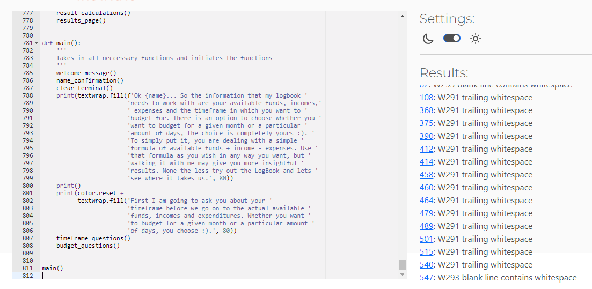

PEP8 Code Validation After Fixes
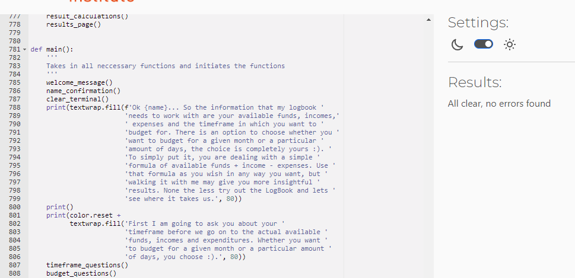

### Manual Testing

<table>
    <tr>
        <th>Feature</th>
        <th>Outcome</th>
        <th>Example</th>
        <th>Pass/Fail</th>
    </tr>
    <tr>
        <td rowspan=2>Name Input</td>
        <td>Validate if value is empty</td>
        <td></td>
        <td>Pass</td>
    </tr>
    <td>Validate if value is too big</td>
        <td></td>
        <td>Pass</td>
    </tr>
    <tr>
        <td rowspan=2>Name y/n Input</td>
        <td>Validate if value is empty</td>
        <td></td>
        <td>Pass</td>
    </tr>
    <td>Validate if value is not y or n</td>
        <td></td>
        <td>Pass</td>
    <tr>
        <td rowspan=2>timeframe y/n Input</td>
        <td>Validate if value is empty</td>
        <td></td>
        <td>Pass</td>
    </tr>
    <td>Validate if value is not y or n</td>
        <td></td>
        <td>Pass</td>
    <tr>
        <td rowspan=4>timeframe month Input</td>
        <td>Validate if value is empty</td>
        <td></td>
        <td>Pass</td>
    </tr>
    <td>Validate if value is 0 or under</td>
        <td></td>
        <td>Pass</td>
    </tr>
    <td>Validate if value is over 12</td>
        <td></td>
        <td>Pass</td>
    </tr>
    <td>Validate if value is an number</td>
        <td></td>
        <td>Pass</td>
    </tr>
    <tr>
        <td rowspan=3>timeframe days Input</td>
        <td>Validate if value is empty</td>
        <td></td>
        <td>Pass</td>
    </tr>
    <td>Validate if value is not an interger</td>
        <td></td>
        <td>Pass</td>
    </tr>
    <td>Validate if value is 0 or under</td>
        <td></td>
        <td>Pass</td>
    </tr>
    <tr>
        <td rowspan=2>timeframe summary y/n Input</td>
        <td>Validate if value is empty</td>
        <td></td>
        <td>Pass</td>
    </tr>
    <td>Validate if value is not y or n</td>
        <td></td>
        <td>Pass</td>
    <tr>
        <td rowspan=2>Available Funds name Input</td>
        <td>Validate if value is empty</td>
        <td></td>
        <td>Pass</td>
    </tr>
        <td>Validate if value is too big</td>
        <td></td>
        <td>Pass</td>
    </tr>
    <tr>
        <td rowspan=2>Available Funds amount Input</td>
        <td>Validate if value is empty</td>
        <td></td>
        <td>Pass</td>
    </tr>
        <td>Validate if value is not a number</td>
        <td></td>
        <td>Pass</td>
    </tr>
    <tr>
        <td rowspan=2>Available Funds add Input</td>
        <td>Validate if value is empty</td>
        <td></td>
        <td>Pass</td>
    </tr>
        <td>Validate if value is not y or n</td>
        <td></td>
        <td>Pass</td>
    </tr>
    <tr>
        <td rowspan=2>Available Funds redo Input</td>
        <td>Validate if value is empty</td>
        <td></td>
        <td>Pass</td>
    </tr>
        <td>Validate if value is not y or n</td>
        <td></td>
        <td>Pass</td>
    </tr>
    <tr>
        <td rowspan=2>Income name Input</td>
        <td>Validate if value is empty</td>
        <td></td>
        <td>Pass</td>
    </tr>
        <td>Validate if value is too big</td>
        <td></td>
        <td>Pass</td>
    </tr>
    <tr>
        <td rowspan=2>Income amount Input</td>
        <td>Validate if value is empty</td>
        <td></td>
        <td>Pass</td>
    </tr>
        <td>Validate if value is not a number</td>
        <td></td>
        <td>Pass</td>
    </tr>
    <tr>
        <td rowspan=2>Income add Input</td>
        <td>Validate if value is empty</td>
        <td></td>
        <td>Pass</td>
    </tr>
        <td>Validate if value is not y or n</td>
        <td></td>
        <td>Pass</td>
    </tr>
    <tr>
        <td rowspan=2>Income redo Input</td>
        <td>Validate if value is empty</td>
        <td></td>
        <td>Pass</td>
    </tr>
        <td>Validate if value is not y or n</td>
        <td></td>
        <td>Pass</td>
    </tr>
    <tr>
        <td rowspan=2>Expense name Input</td>
        <td>Validate if value is empty</td>
        <td></td>
        <td>Pass</td>
    </tr>
        <td>Validate if value is too big</td>
        <td></td>
        <td>Pass</td>
    </tr>
    <tr>
        <td rowspan=2>Expense Funds amount Input</td>
        <td>Validate if value is empty</td>
        <td></td>
        <td>Pass</td>
    </tr>
        <td>Validate if value is not a number</td>
        <td></td>
        <td>Pass</td>
    </tr>
    <tr>
        <td rowspan=2>Expense add Input</td>
        <td>Validate if value is empty</td>
        <td></td>
        <td>Pass</td>
    </tr>
        <td>Validate if value is not y or n</td>
        <td></td>
        <td>Pass</td>
    </tr>
    <tr>
        <td rowspan=2>Expense redo Input</td>
        <td>Validate if value is empty</td>
        <td></td>
        <td>Pass</td>
    </tr>
        <td>Validate if value is not y or n</td>
        <td></td>
        <td>Pass</td>
    </tr>

[Back to top ⇧](#larrys-logbook)

## Deployment

The project has been deployed using [Heroku](https://id.heroku.com/) by following these steps:

[Heroku](https://id.heroku.com/) was used to deploy the application.

1. Create the requirements.txt file and run: `pip3 freeze > requirements.txt` in the console.
2. Commit changes and push them to GitHub.
3. Go to the Heroku's website.
4. From the Heroku dashboard, click on "Create new app".
5. Enter the "App name" and "Choose a region" before clicking on "Create app".
6. Go to "Config Vars" under the "Settings" tab.
7. Click on "Reveals Config Vars" and add the KEY: CREDS and the VALUE stored in creds.json file if needed.
8. Add the Config Var, KEY: PORT and VALUE: 8000.
9. Go to "Buildpacks" section and click "Add buildpack".
10. Select "python" and click "Save changes"
11. Add "nodejs" buildpack as well using the same process.
12. Go to "Deployment method", under the "Deploy" tab select "GitHub" and click on "Connect to GitHub".
13. Go to "Connect to GitHub" section and "Search" the repository to be deployed.
14. Click "Connect" next the repository name.
15. Choose "Automatic deploys" or "Manual deploys" to deploy your application.

[Back to top ⇧](#larrys-logbook)

## Credits

### Media

* The ASCII Art Archive has been used for the heading of the application [ASCII Art Archive](https://www.asciiart.eu/logos/kool-aid).

### Code

* Majority of the code is of my own making.

* Guidance on how to begin a budgeting application with python from youtuber [LeMaster Tech](https://www.youtube.com/watch?v=DVbP7JqjHeQ&list=LL&index=1&t=617s).

* codedamn used for how to go about float values for int/float inputs.

* Some code ideas and structure of how to go about the readme file from [josswe26-macro-calculator](jhttps://josswe26-macro-calculato-n86n9ejynl.us2.codeanyapp.com/#/workspaces/macro-calculator). 

[Back to top ⇧](#larrys-logbook)

## Acknowledgements

* My Lord and Saviour Jesus Christ, for giving me the patience and courage to get through all the hard times within this project and outside it

* My Wife and Son for their unconditional support throughout.

* My Good friend Nathan Deg, for some guidance on python code and python in general.

* My tutor, Marcel Mulders, and my temporary tutor Matt Bodden for their invaluable feedback and guidance.

* Code Institute and its amazing Slack community for their support and providing me with the necessary knowledge to complete this project.

